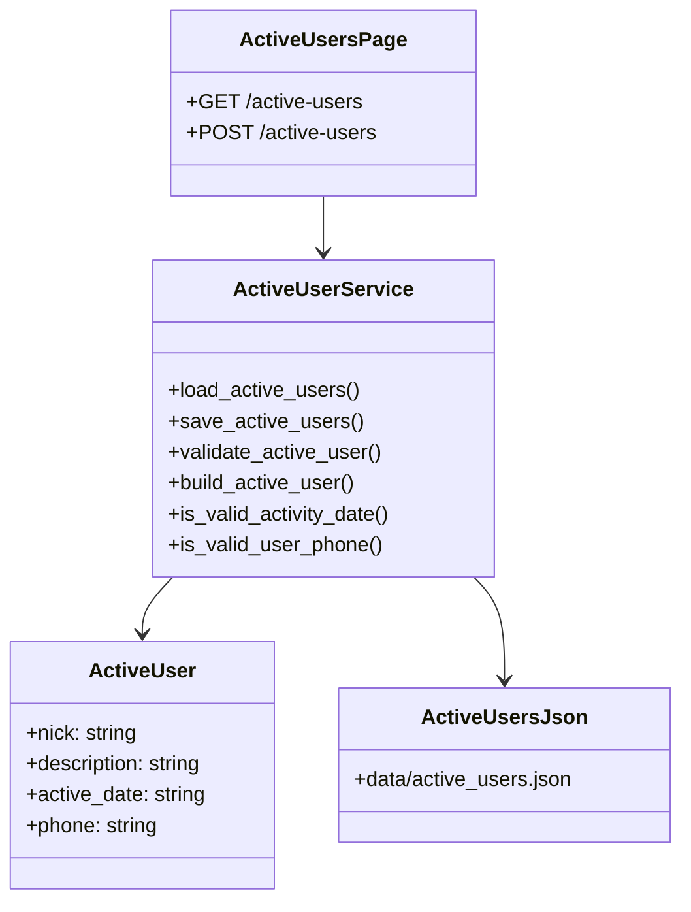

# Отчет по интеграции страницы активных пользователей

## 1. Техническое задание

Вариант 6: интегрировать в сайт на Bottle страницу `Активных пользователей`.

Страница должна:

- выводить перечень активных пользователей, загружаемый Python-кодом из файла;
- содержать форму добавления нового пользователя;
- иметь обязательные поля: ник, описание активности, дата активности, телефон;
- выполнять проверку корректности заполнения;
- показывать ошибки на этой же странице;
- сохранять введенные значения при ошибках;
- после успешной отправки добавлять объект в общий список;
- очищать форму после успешной отправки;
- сортировать пользователей по свежести активности;
- соответствовать стилю сайта;
- иметь стили в CSS-файлах;
- иметь минимум 2 unit-теста для проверки даты или телефона.

## 2. Реализованные файлы

- `routes.py` - добавлены маршруты `GET /active-users` и `POST /active-users`.
- `active_user_service.py` - логика загрузки, сохранения, сортировки и валидации активных пользователей.
- `data/active_users.json` - файл хранения активных пользователей.
- `views/active-users.tpl` - HTML5-шаблон страницы активных пользователей.
- `static/content/css/active-users/` - CSS-оформление страницы.
- `tests/test_active_user_validation.py` - unit-тесты даты активности и телефона.
- `views/index.tpl` - главная навигация дополнена ссылкой на активных пользователей.

## 3. UML-диаграмма



## 4. Код с комментариями

Ключевой модуль `active_user_service.py` содержит комментарии к правилам даты, телефона, обработке поврежденного JSON и назначению функций.

Пример проверки телефона:

```python
def is_valid_user_phone(value: str) -> bool:
    """Validate the active user's phone number."""

    if not PHONE_PATTERN.match(value):
        return False

    digits = re.sub(r"\D", "", value)
    return len(digits) == 11 and digits[0] in {"7", "8"}
```

Пример обработки ошибок формы в `routes.py`:

```python
if errors:
    # Return the same form values so the user can correct only invalid
    # fields instead of retyping the whole form.
    return {
        "users": users,
        "errors": errors,
        "form": form,
    }
```

## 5. Скриншоты для отчета

В отчет по работе нужно вставить актуальные изображения из браузера:

- главная страница `/` с добавленной ссылкой `Пользователи`;
- страница `/active-users` со списком активных пользователей;
- страница `/active-users` с ошибками валидации;
- страница `/active-users` после успешного добавления пользователя;
- результат запуска unit-тестов;
- окно системы контроля версий с измененными файлами.

## 6. Тестирование

Команда запуска:

```powershell
python -m unittest discover -s tests
```

Проверяются сценарии:

- корректная дата `YYYY-MM-DD`;
- некорректный формат даты;
- корректный российский телефон;
- некорректный короткий телефон.

## 7. Отладка и исключения

В `active_user_service.py` обработаны возможные ошибки чтения файла:

- файл отсутствует;
- JSON поврежден;
- содержимое файла не является списком.

В этих случаях страница продолжает открываться и показывает пустой список.

## 8. Система контроля версий

Для фиксации результата рекомендуется выполнить:

```powershell
git status --short
git add .
git commit -m "Add active users page with validation and tests"
```
