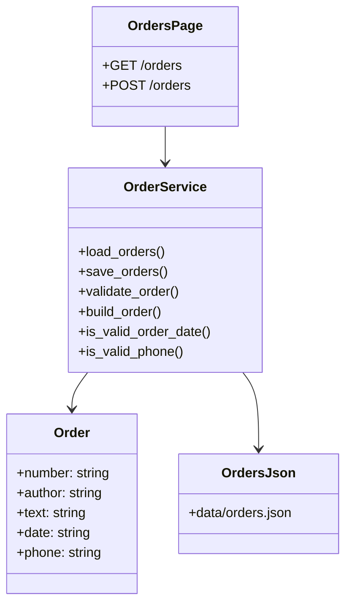

# Отчет по интеграции страницы оформленных заказов

## 1. Техническое задание

Требуется интегрировать в сайт на Bottle страницу варианта 3: `Оформленных заказов`.

Страница должна:

- выводить перечень заказов, загружаемый Python-кодом из файла;
- содержать форму добавления нового заказа;
- иметь обязательные поля: номер, автор/клиент, описание, дата, телефон;
- выполнять проверку корректности заполнения;
- показывать ошибки на этой же странице;
- сохранять введенные значения при ошибках;
- после успешной отправки добавлять объект в общий список;
- очищать форму после успешной отправки;
- сортировать заказы по свежести;
- соответствовать стилю сайта;
- иметь стили в CSS-файлах;
- иметь минимум 2 unit-теста для проверки даты или телефона.

## 2. Реализованные файлы

- `routes.py` - добавлены маршруты `GET /orders` и `POST /orders`.
- `order_service.py` - логика загрузки, сохранения, сортировки и валидации заказов.
- `data/orders.json` - файл хранения заказов.
- `views/orders.tpl` - HTML5-шаблон страницы заказов.
- `static/content/css/orders/` - CSS-оформление страницы заказов.
- `tests/test_order_validation.py` - unit-тесты даты и телефона.
- `views/index.tpl` - главная навигация дополнена ссылкой на заказы.

## 3. UML-диаграмма



## 4. Код с комментариями

Ключевой модуль `order_service.py` содержит комментарии к правилам даты, телефона, обработке поврежденного JSON и назначению функций.

Пример проверки телефона:

```python
def is_valid_phone(value: str) -> bool:
    """Validate Russian phone input by format and digit count."""

    if not PHONE_PATTERN.match(value):
        return False

    digits = re.sub(r"\D", "", value)
    return len(digits) == 11 and digits[0] in {"7", "8"}
```

Пример обработки ошибок формы в `routes.py`:

```python
if errors:
    # The same template receives the previous form values, so the user does
    # not need to type everything again after a validation error.
    return {
        "orders": orders,
        "errors": errors,
        "form": form,
    }
```

## 5. Скриншоты для отчета

В отчет по работе нужно вставить актуальные изображения из браузера:

- главная страница `/` с добавленной ссылкой `Заказы`;
- страница `/orders` со списком заказов;
- страница `/orders` с ошибками валидации;
- страница `/orders` после успешного добавления заказа;
- результат запуска unit-тестов;
- окно системы контроля версий с измененными файлами.

## 6. Тестирование

Команда запуска:

```powershell
python -m unittest discover -s tests
```

Проверяются сценарии:

- корректная дата `YYYY-MM-DD`;
- некорректный формат даты;
- корректный российский телефон;
- некорректный короткий телефон.

## 7. Отладка и исключения

В `order_service.py` обработаны возможные ошибки чтения файла:

- файл отсутствует;
- JSON поврежден;
- содержимое файла не является списком.

В этих случаях страница продолжает открываться и показывает пустой список, что предотвращает падение приложения.

## 8. Система контроля версий

Для фиксации результата рекомендуется выполнить:

```powershell
git status --short
git add .
git commit -m "Add orders page with validation and tests"
```
